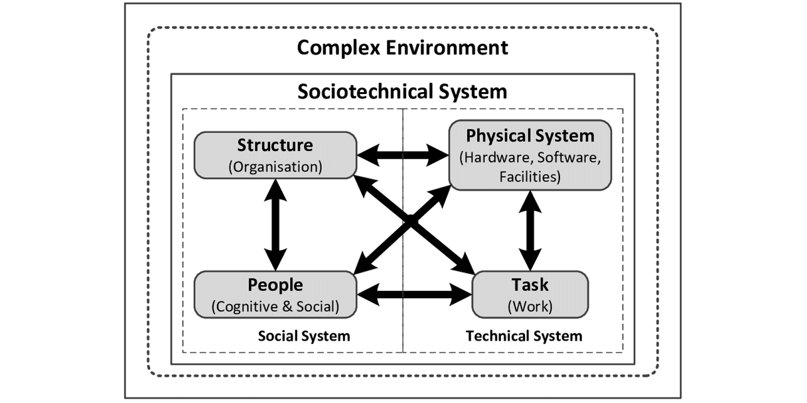

# Sociotechnical Architecture - people and resources

A collection of resources and links relating to sociotechnical architecture for software systems.

> Licenced under [CC BY-SA 4.0](https://creativecommons.org/licenses/by-sa/4.0/) 

## Overview

_Sociotechnical System - from https://www.researchgate.net/figure/Sociotechnical-system-STS-4_fig2_306242078_

> Sociotechnical architecture patterns are there to guide us into designing sociotechnical systems that channel the flow of work through our systems toward optimal business outcomes. Accordingly, we must diligently co-design the relationships in our social and technical architectures.

-- Nick Tune, [An Introduction to Sociotechnical Architecture Patterns](https://medium.com/nick-tune-tech-strategy-blog/an-introduction-to-sociotechnical-architecture-patterns-ea64a75c2aaf)

> The foundation of Sociotechnical Architecture is to have a co-design approach to architecture, where we don't just look at the technical systems architecture of the product, but also to the organization system (teams) building and owning it. Why? Because they have a lot of influence on each other and neglecting is not allowing for a proper design and developments.

-- Eduardo da Silva, [Introduction to Sociotechnical Architecture: Why & What is it](https://esilva.net/sociotechnical/sociotechnical-architecture_why-and-what.html)

# People

_{Format: Name - 10 or fewer words describing their focus - Twitter - website}_

Alphabetically by name:

* Diana Larsen - Author: Agile Retrospectives, Agile Fluency model - [@DianaOfPortland](https://twitter.com/DianaOfPortland) - [agilefluency.org](https://www.agilefluency.org/)
* Eduardo da Silva - Sociotechnical Systems Architect - [@emgsilva](https://twitter.com/emgsilva) - [esilva.net](https://esilva.net/)
* Ersin Er - architecting for scale, systems and modeling, tech leadership - [@ersiner](https://twitter.com/ersiner)
* Jabe Bloom - Gonzo Philosophy & Design for Industry & the Academy - [@cyetain](https://twitter.com/cyetain) - [jabe.co](http://jabe.co/)
* Jessica Kerr - Sociotechnical Systems Architect, Symmathecist - [@jessitron](https://twitter.com/jessitron) - [jessitron.com](https://jessitron.com/)
* Manuel Pais - Co-author of Team Topologies - [@manupaisable](https://twitter.com/manupaisable) - [manuelpais.net](https://www.manuelpais.net/)
* Matthew Skelton - Co-author of Team Topologies - [@matthewpskelton](https://twitter.com/matthewpskelton) - [matthewskelton.net](https://www.matthewskelton.net/)
* Michael Plöd - Fellow at INNOQ, author of "Hands-on Domain-driven Design by example - [@bitboss](https://twitter.com/bitboss) - [leanpub.com/ddd-by-example](https://leanpub.com/ddd-by-example)
* Nick Tune - DDD, sociotechnical design, Team Topologies - [@ntcoding](https://twitter.com/ntcoding) - [ntcoding.co.uk](https://www.ntcoding.co.uk/)
* Ruth Malan - architecting for agility, design, visual thinking, Conway's Law - [@ruthmalan](https://twitter.com/ruthmalan) - [ruthmalan.com](https://ruthmalan.com/)
* Sal Freudenberg - researcher into psychology of programming and distributed teams - [@SalFreudenberg](https://twitter.com/SalFreudenberg) - [salfreudenberg.wordpress.com](https://salfreudenberg.wordpress.com/)
* Susanne Kaiser - Wardley Maps, DDD, Team Topologies - [@suksr](https://twitter.com/suksr) - [susannekaiser.net](https://www.susannekaiser.net/)
* Trond Hjorteland - Aspiring sociotechnical systems designer at Scienta.no - [@trondhjort](https://twitter.com/trondhjort) - [trond.hjorteland.com](https://trond.hjorteland.com/)

# Books

* 

# Other resources

Alphabetically by title:

* [Nick Tune's Strategic Technology Blog](https://medium.com/nick-tune-tech-strategy-blog) - Nick Tune
* [Sociotechnical Architecture & Systems](https://esilva.net/sociotechnical) - Eduardo da Silva

# Acknowledgement and thanks

1. Thanks to Eduardo da Silva and Ersin Er for [starting (on Twitter) a list of people in the sociotechnical architecture space](https://twitter.com/emgsilva/status/1380452731287175170) 
